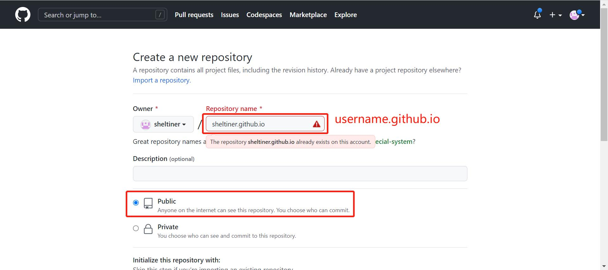
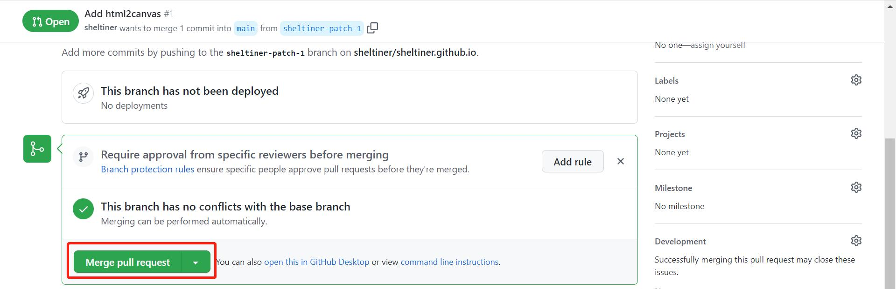
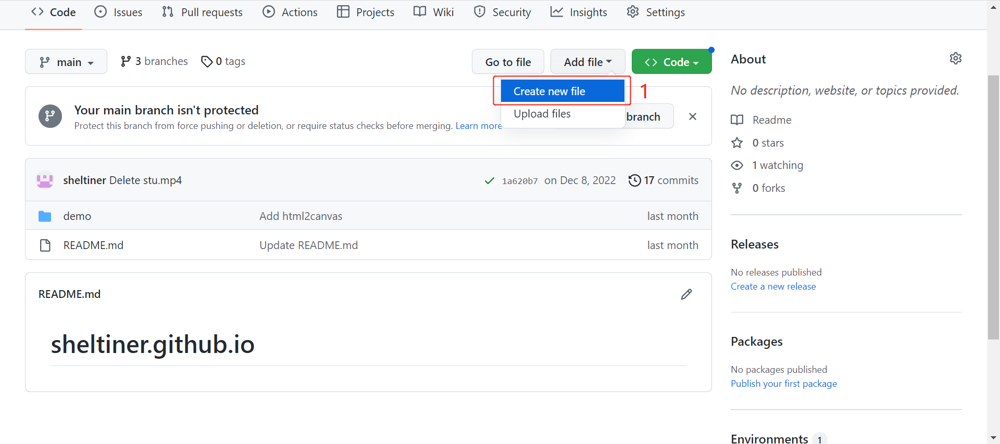
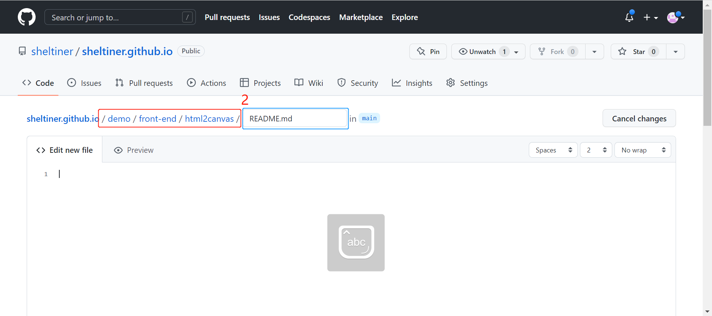
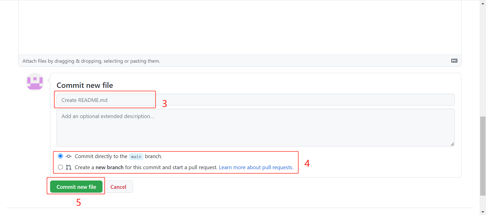
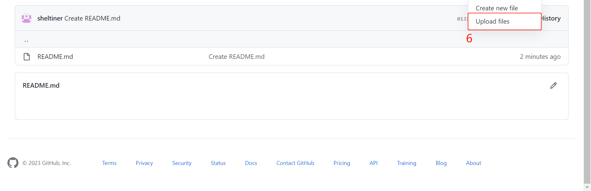

## GitHub Page

#### 1. Create a repository

1）新建一个新的公共仓库，命名为 `username.github.io`，其中username是你的github用户名

2）选择仓库为公开形式

3）选择添加一个README文件，以此来初始化仓库

4）选定后，创建仓库

#### 2. Get Address

1）进入上面创建的仓库，点击 `Setting`

2）在 `Setting` 中，`General` -->  `Code and automation` -->  `Pages`

3）复制site地址打开网页，即仓库对应的网页

4）可选修改部署的分支，在 `Branch` 修改 `main` -- `/root`，然后 保存

> main（分支）可改成None（无），/root可改成其他文件夹作为发布源的文件夹

#### 3. Upload Files

1）回到仓库主页，选择 `Code` --> `Add file`

2）拖拽文件至中间添加文件区，或点击中间文件区选择本地项目文件

> 在添加文件区下方可查看确认已添加的文件

3）提交添加的项目文件，填写 `comment`

4）选择提交方式，建议选择新建一个分支后合并到主分支

> 若此仓库只有一个维护可选择直接合并到主分支；若多人维护建议选择新建分支后再合并到主分支

5）确认提交

6）新建一个拉取请求，将刚刚新建的分支合并到主分支上

#### 4. Check the Upload

打开 `步骤2(3)`中的网址，即可查看项目部署结果

#### *PS. 将项目部署到非根目录

由于通常根目录是用于部署个人主页，所以非个人主页的项目文件可以部署在子目录下，参考步骤如下：

### My Result

浏览器打开 https://sheltiner.github.io/demo/front-end/html2canvas/

